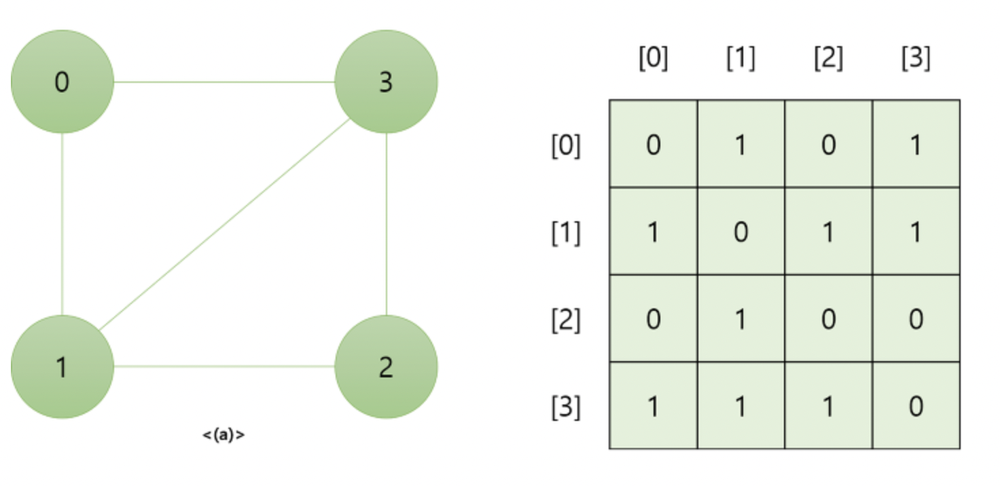
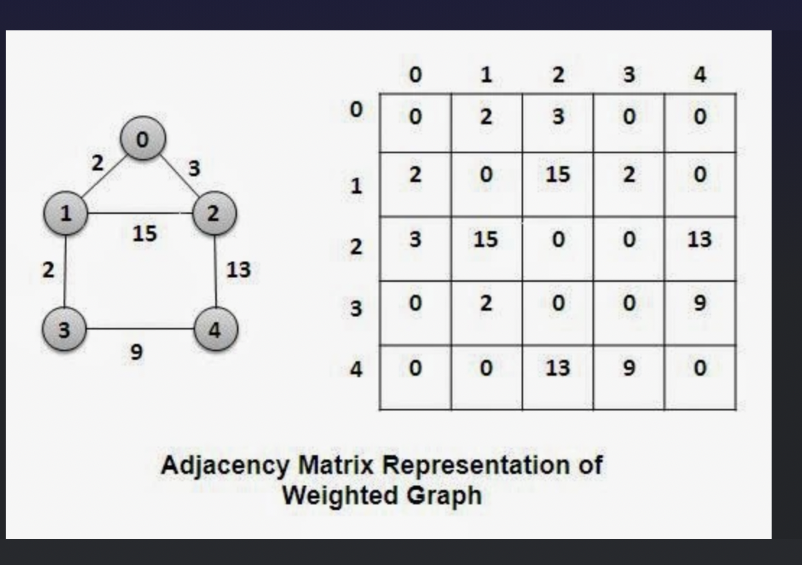
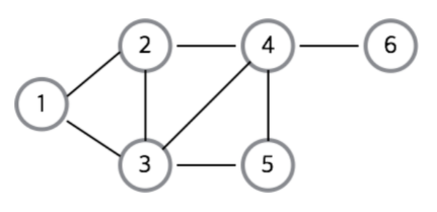
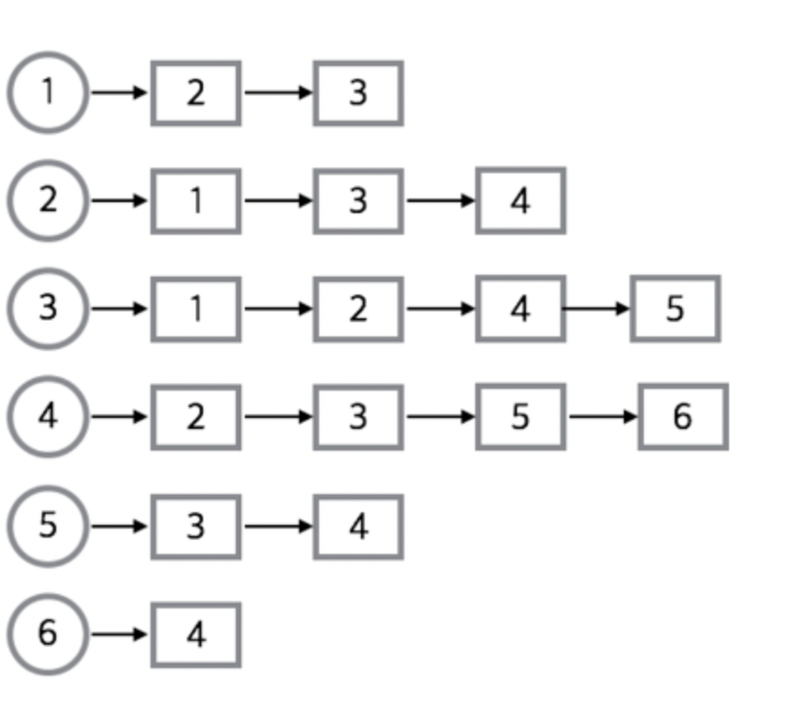

# 그래프

 

자료구조에서 그래프는 연결 데이터를 저장할 수 있는 자료구조를 말한다.

 

## 특징

 

그래프는 연결관계를 위해 사용한다

 

사용 예제

- 위치 데이터 : 지도, 네비게이터, 최단경로를 구할때
- 사회 연결망 : 페이스북, 같이 서로 연결되있는지 확인 가능

 

## 용어

 

- 노드 : 기본적인 단위, 그래프에서 하나의 데이터 단위
- 엣지 : 두 노드의 직접적인 연결 관계 데이터
- 인접 : 엣지가 있으면 인접해있다라고 한다.
- 경로 : 목표노드로 가는 길을 경로라고한다.
- 거리 : 경로사이의 엣지의 수를 거리라고 한다.
- 최단경로 : 경로들 사이에서 가장 짧은 거리를 최단 경로라고 한다.
- 사이클 : 특정 노드에서 그 노드로 돌아오는 경로를 사이클 이라고 한다.
- 차수 : 한 노드가 가지고 있는 엣지의 수를 차수라고 한다.

 

## 방향 그래프

노드가 다른 노드들을 가리키는 방향이 있는 엣지들이 있으면 방향그래프 라고한다.

 

엣지는 노드가 단 하나의 노드를 바라보는것이 아닌 서로 바라보는 엣지가 될 수 도있다.

 

### 용어

 

출력차수 : 노드에서 다른 노드로 가는 방향으로가는 차수를 말한다

입력차수 : 다른 노드에서 자신의 노드로 들어오는 차수를 말한다.

 

ex) 인스타그램 팔로우

사용자1 → 사용자2

 

## 무방향 그래프

엣지가 쌍방향이면 방향이 없다는 그래프인, 무방향 그래프 라고 한다.

 

## 가중치 그래프

가중치 그래프는 엣지들이 연결 관계뿐만 아니라 어떠한 정보를 나타내는 수치를 말한다.

 

예를들어 위치 정보 그래프이면 두 장소의 거리를 말한다.

 

### 엣지

가중치 그래프에서의 경로의 거리는 한 경로에 있는 엣지의 가중치의 합을 말한다

 

## 인접 행렬

- 각 노드를 배열에 저장해 고유 정수 인덱스를 준다.
- 노드 수 X 노드 수 크기의 행렬을 만든다
- 노드들의 엣지 유무 및 가중치에 따라 행렬의 요소를 채운다.

 

이미지 출처: [https://kingpodo.tistory.com/46](https://kingpodo.tistory.com/46)

 

인접 행렬을 통해 노드의 엣지를 확인 할 수 있다.

 

### 가중치 그래프의 인접행렬

가중치 그래프의 인접행렬도 마찬가지로 행렬의 값에 가중치를 넣어주면 된다.

이미지 출처: [https://imgur.com/zAyiJXm](https://imgur.com/zAyiJXm)

 

## 인접 리스트

인접리스트는 노드들의 인접한 데이터를 배열에 저장하는 방법이다.

 

배열에 그래프 노드가 연결된 리스트에 대한 정보를 저장한다.

 

### 무방향 그래프

예시 그래프) A와 B가 연결된 무방향 그래프

A - B

→ A의 인접 리스트에 B를 넣는다

→ B의 인접 리스트에 A를 넣는다.

 

### 방향 그래프

예시 그래프) A에서 B로 방향을 가리키는 그래프

A → B

→ A의 인접 리스트에 B를 넣는다

→ B의 인접 리스트에는 아무것도 없다.

 

### 가중치 그래프

예시 그래프) A와 B가 연결된 가중치 그래프

A - B 4의 가중치

→ A의 인접 리스트에 [[B, 4]] 를 넣는다.

→ B의 인접 리스트에 [[A, 4]] 를 넣는다.

 

### 인접리스트 정리

인접리스트는 여러개의 노드가 있고 하나의 각자의 노드는 자신이 인접한 노드에 대한 레퍼런스를 넣어주면 된다.

 

**즉, 각 노드의 엣지를 리스트에 저장하는 방법**

 

이미지 출처: [https://freestrokes.tistory.com/87](https://freestrokes.tistory.com/87)

 

## 인접 행렬 vs 인접 리스트

 

### V, E

V는 그래프의 노드의 집합이다. V는 Vertex의 가장 앞글자를 따서 만들었다.

1,2,3,4 의 노드들이 있다면 V는 1,2,3,4를 합친게 V이다.

 

E는 그래프 안에 있는 모든 엣지들의 집합이다. E는 Edge의 가장 앞글자를 따서 만들었다.

 

위의 인접리스트에 있는 첫번째 이미지의 그래프에서의 V는 6 E는 8이다.

 

### V와 E의 관계

그래프안에서 최대의 엣지 개수

 

모든 노드가 서로다른 모든 노드에 연결되어 있는 경우가 엣지가 가장 많을 때이다.

- 무방향 그래프 → V\*\*2 / 2
- 방향 그래프 → V\*\*2

 

따라서 E는 최악의 경우 모두 V\*\*2 에 비례한다

 

### 공간 복잡도

 

노드를 저장하는 공간

- 총 노드의 개수인 O(V) 이다.

 

**인접 행렬**이 차지하는 공간

- 인접행렬은 총 노드의 수 \* 총 노드의 수 만큼 행렬을 만든다.

  → 따라서 O(V\*\*2) 이다.

 

**인접 리스트**가 차지하는 공간

- 모든 노드는 하나의 인접 리스트를 갖는다.

  → 따라서 V에 비례하므로 최소 O(V)에 비례한다.

- 엣지를 저장하는데 필요한 공간

  → 모든 노드에 저장된 엣지 데이터를 다 합치면 무방향 그래프일때 2E

  → 방향 그래프일때 E 이다.

  → 따라서 O(E) 이다.

- 따라서 인접리스트 자체를 저장하는데 필요한 공간은 O(V), 엣지를 저장하는데 O(E)을 사용하기 때문에 O(V + E)을 사용한다.

 

### 시간 복잡도

 

**두 노드가 연결되었는지 확인하는데 걸리는 시간**

- 인접행렬 → 해당 노드들의 인덱스를 정확히 찾으면 된다 ,따라서 O(1) 이걸린다.

  → ex) 3과 5의 노드들이 연결 되어있는지 확인한다고 한다면 matrix[3][5]

- 인접 리스트 → 한 노드의 리스트안에 특정 역이 저장되어있는지 선형 탐색으로 다 돌아야한다, 즉 V개의 요소를 확인해야한다.

 

**한 노드가 연결된 모든 노드를 알아내는데 걸리는 시간**

- 인접 행렬 → 리스트 안의 데이터를 모두 돌면서 0인지 1인지를 확인해야한다. 따라서 매번 V번 돌아야한다.
- 인접 리스트 → 각 노드들은 자신과 인접한 노드들에 대한 정보만 가지고 있다. 따라서 최악의 경우에는 V번 돌어야하지만 대부분은 인접 행렬보다 빠르게 실행된다.

 

따라서 결론은 인접 리스트가 인접 행렬보다 좀더 빠르므로 인접 리스트를 사용하는 것이 좋다.

 

참고

- 코드잇 자료구조 강의
- [https://kingpodo.tistory.com/46](https://kingpodo.tistory.com/46)
- [https://imgur.com/zAyiJXm](https://imgur.com/zAyiJXm)
- [https://freestrokes.tistory.com/87](https://freestrokes.tistory.com/87)
